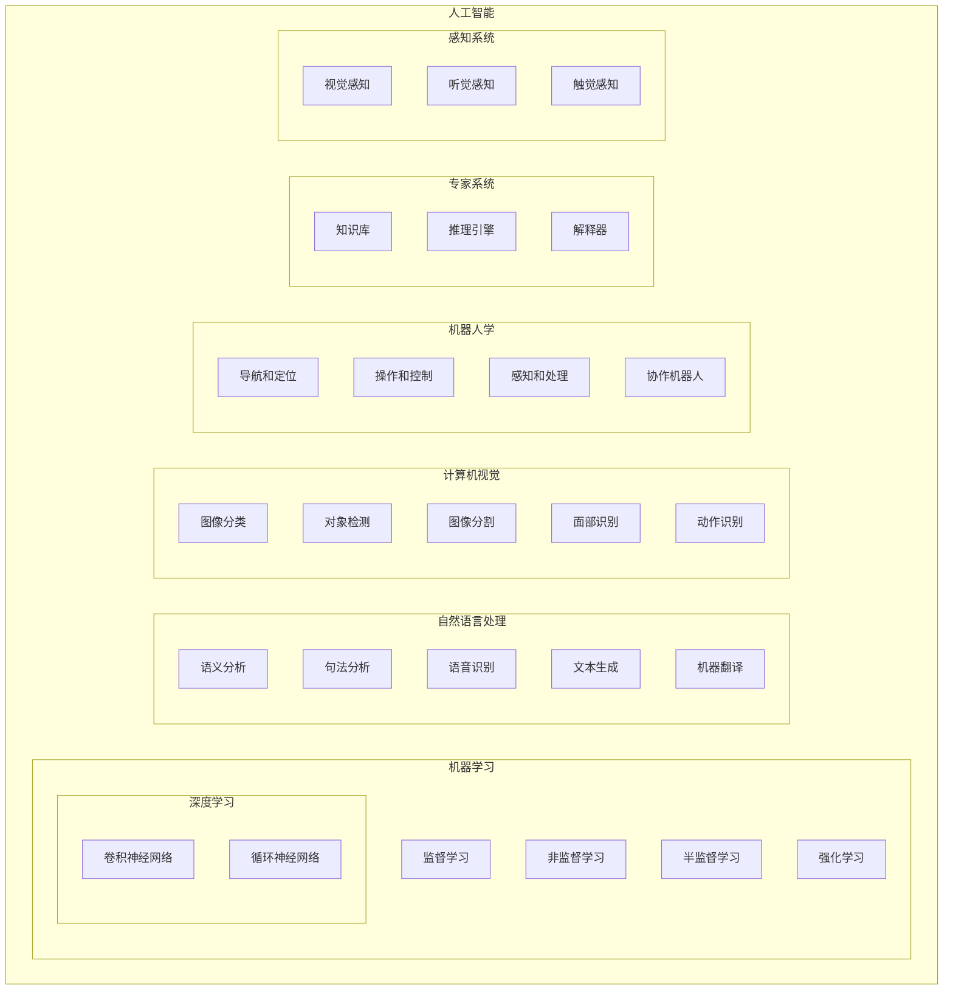

# AI 领域

## 人工智能领域

## 机器学习

### 监督学习（Supervised Learning）

在监督学习中，算法从标记的训练数据中学习，每个训练样本都有一个输入对象（特征向量）和一个期望的输出值（标签）。

算法的目标是学习一个模型，使其能够准确地预测新的、未见过的数据。

### 非监督学习（Unsupervised Learning）

非监督学习的算法试图从未标记的数据中找到隐藏的结构。由于输入数据没有标签，因此算法需要自行发现数据中的模式和关系。

### 半监督学习（Semi-Supervised Learning）

半监督学习介于监督学习和非监督学习之间。

它使用少量标记数据和大量未标记数据进行训练，这种方法在标记数据昂贵或难以获得，但未标记数据易于获取的情况下非常有用。

### 强化学习（Reinforcement Learning）

在强化学习中，算法（或称为代理）通过与环境交互来学习行为策略，目标是最大化累积奖励。

这种学习与上述三种形式不同，它侧重于在一定的策略下进行决策序列，而非单次预测。
