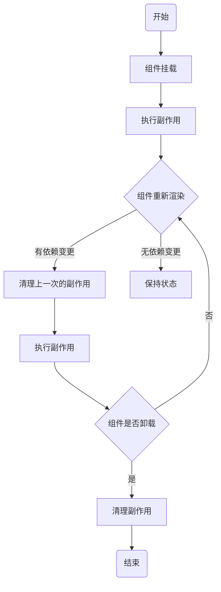

# useEffect

## 什么是 useEffect

`useEffect` 是一个 React Hook，用于在函数组件中执行副作用（数据获取、订阅、DOM操作）。

## 基本语法
   
```tsx
useEffect(() => {
  // 副作用逻辑
  return () => {
    // 清理函数
  };
}, [dependencies]);
```
:::warning 注意
- 在严格模式开发中，useEffect有一个额外的执行周期（副作用函数+清理函数），用于发现潜在问题。
- 如果依赖项是组件内部的对象或函数，每次渲染都会创建新的对象或函数，导致依赖项变化，进而导致副作用函数重复执行，可以使用`useMemo`或`useCallback`解决。
:::

## 依赖项

| 依赖项规则   | 副作用执行规则             |
| ------------ | -------------------------- |
| 不传递依赖项 | 在每次渲染后都会执行。     |
| 若传递空数组 | 只在组件挂载和卸载时执行。 |
| 若传递依赖项 | 只在依赖项变化时执行。     |

## 处理异步操作

::: code-group 
```tsx [先定义再调用]
useEffect(() => {
  const fetchData = async () => {
    await fetch('https://api.example.com/data');
  };
  fetchData();
}, []);
```

```tsx [直接调用]
useEffect(() => {
  (async () => {
    await fetch('https://api.example.com/data');
  })();
}, []);
```
:::

## 生命周期

