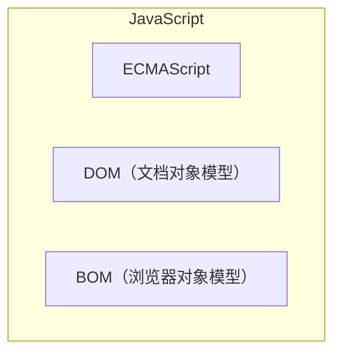

# JavaScript

## JavaScript的历史

JavaScript的历史展示了它是如何从一个用于简单客户端数据验证的脚本语言，演变成为一门支持前后端开发、跨多个环境应用的全栈编程语言，成为世界上最流行的编程语言之一。

### 诞生初期
1989年，欧洲核子研究组织提出了全球互联信息共享网络的概念，奠定了互联网的基础。

1990年，世界上第一个网页和浏览器——WorldWideWeb和Nexus浏览器问世。HTML的诞生为构建网页提供了基石。

1993年，Mosaic浏览器的推出，引入了图形界面网页浏览器的概念，提高了网页的可访问性。

1994年，网景公司发布Netscape Navigator浏览器，为了解决客户端简单表单验证的需求，开始开发一种客户端脚本语言。

1995年，网景公司为即将发布的Netscape Navigator 2.0浏览器开发了一个名为LiveScript的脚本语言。就在Netscape Navigator 2正式发布前，网景把LiveScript改名为JavaScript，以便搭上媒体当时热烈炒作Java的顺风车。

由于JavaScript 1.0很成功，网景又在Netscape Navigator 3中发布了JavaScript 1.1版本。

### 标准化时期

1996年，微软应对网景公司的JavaScript推出了自己的版本——JScript，并将其集成到了IE3浏览器中。这一举措导致了市场上出现了两种不同的JavaScript实现，即网景的JavaScript和微软的JScript。这种分歧让业界深刻意识到，为了避免兼容性问题并促进Web技术的健康发展，迫切需要制定一个统一的JavaScript规范。因此，这一需求促进了JavaScript语言标准化工作的启动。

1997年，JavaScript 1.1提交给欧洲计算机制造商协会（ECMA），标志着JavaScript正式开始标准化过程，ECMAScript成为JavaScript的官方标准。

自此以后，各家浏览器均以ECMAScript作为自己JavaScript实现的依据，虽然具体实现各有不同。

### 快速发展时期

2002年，Firefox浏览器发布，其JavaScript引擎SpiderMonkey标志着开源社区对JavaScript开发的重要贡献。

2008年，Google的Chrome浏览器及其V8引擎的发布，显著提高了JavaScript的执行效率。

2009年，Node.js的诞生使JavaScript能够运行在服务器端，彻底改变了Web开发的景象。

至此，JavaScript从简单的客户端表单验证脚本发展成为一门全栈技术的核心语言，成为了世界上最流行的编程语言之一。

## JavaScript的实现

完整的JavaScript包含以下三个部分：
- ECMAScript：由ECMA-262定义并提供核心功能
- DOM：提供与网页内容交互的方法和接口
- BOM：提供与浏览器交互的方法和接口