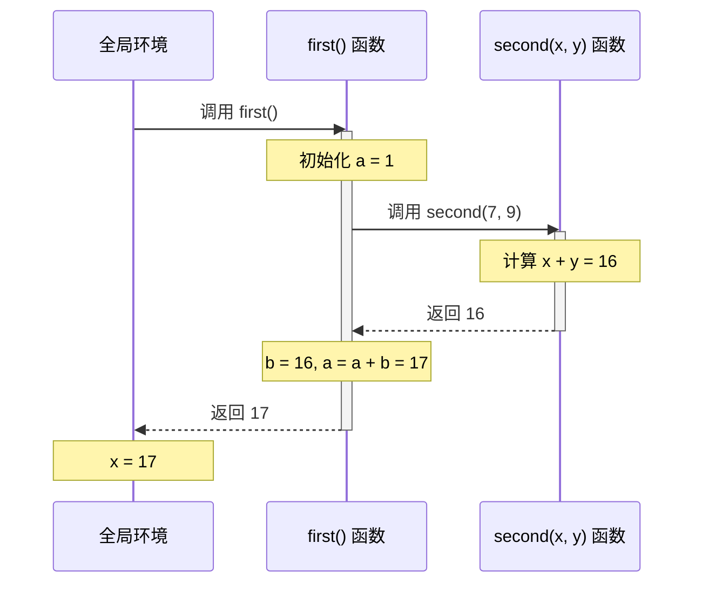

# JavaScript 调用栈

## 什么是调用栈

调用栈是一种数据结构，用来存储函数调用的信息。当一个函数被调用时，调用栈会将函数的调用信息压入栈中。当函数执行完毕时，调用栈会将函数的调用信息从栈中弹出。

## 调用栈的特点

调用栈是一个后进先出（LIFO）的数据结构，即最后一个压入栈的函数会最先弹出栈。

每当一个新的函数被调用时，它的调用记录（也称栈帧，包含函数的参数、局部变量以及其他的状态信息）会被压入调用栈的顶部。

当函数执行完毕后，其对应的栈帧会从调用栈中弹出，控制权会返回到上一个栈帧代表的函数。

## 举例演示调用栈的执行流程

::: details 演示代码

```js
const name = "Alice";

const first() = () => {
    let a = 1;
    const b = second(7, 9);
    a = a + b;
    return a;
}

function second(x, y) {
    return x + y;
}

const x = first();
```

:::


