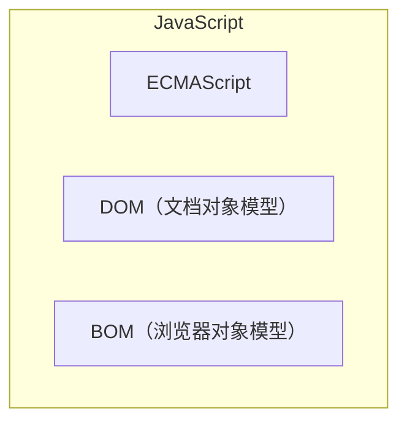

# JavaScript 核心实现

完整的 JavaScript 包含以下三个部分：

- ECMAScript：由 ECMA-262 定义并提供核心功能
- DOM：提供与网页内容交互的方法和接口
- BOM：提供与浏览器交互的方法和接口

```mermaid
graph TD
    subgraph A[JavaScript]
        B[ECMAScript]
        C[DOM（文档对象模型）]
        D[BOM（浏览器对象模型）]
    end
```
