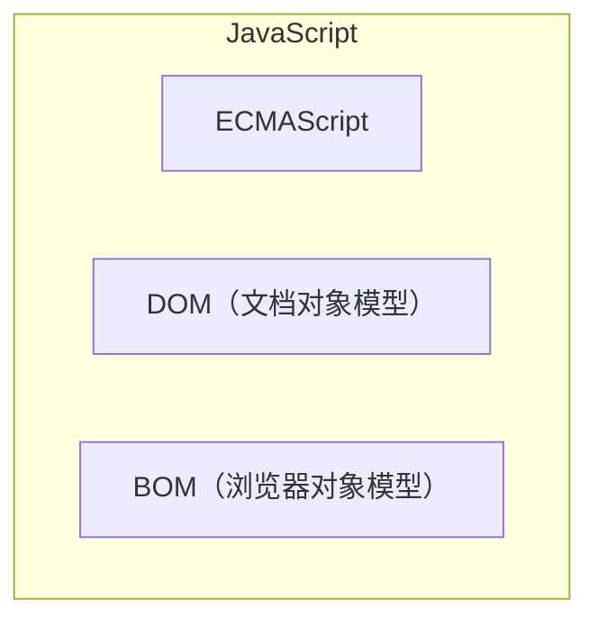

# 什么是 JavaScript

## JavaScript 是什么

JavaScript 问世之初是一种用于表单验证的客户端脚本语言（为了解决表单验证需要与服务器一次往返通信的问题）。

现如今，JavaScript 早已不再局限于数据验证，而是发展成为一门公认的主流编程语言，能够实现复杂的计算和交互。

浏览器是 JavaScript 最早的宿主环境，浏览器环境允许 JavaScript 发送网络请求、操作 DOM、接收用户输入等。

2010 年以后，Node.js 是 JavaScript 另一宿主环境，Node.js 给于 JavaScript 整个操作系统的访问权限，使得 JavaScript 能够在服务器端运行。

## JavaScript 的核心实现

完整的 JavaScript 包含以下三个部分：

- ECMAScript：由 ECMA-262 定义并提供核心功能
- DOM：提供与网页内容交互的方法和接口
- BOM：提供与浏览器交互的方法和接口

